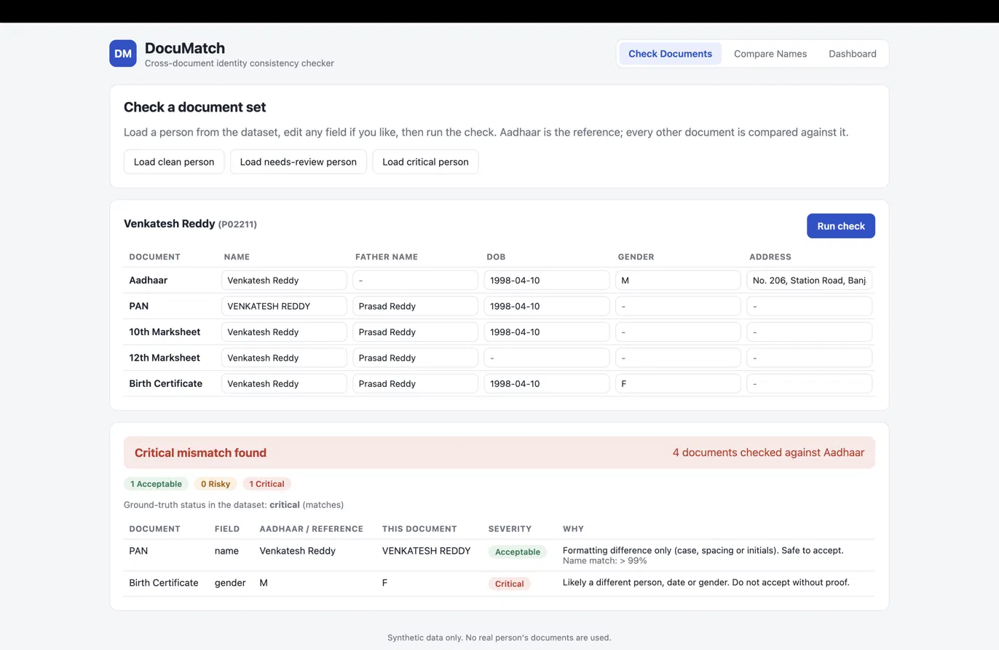
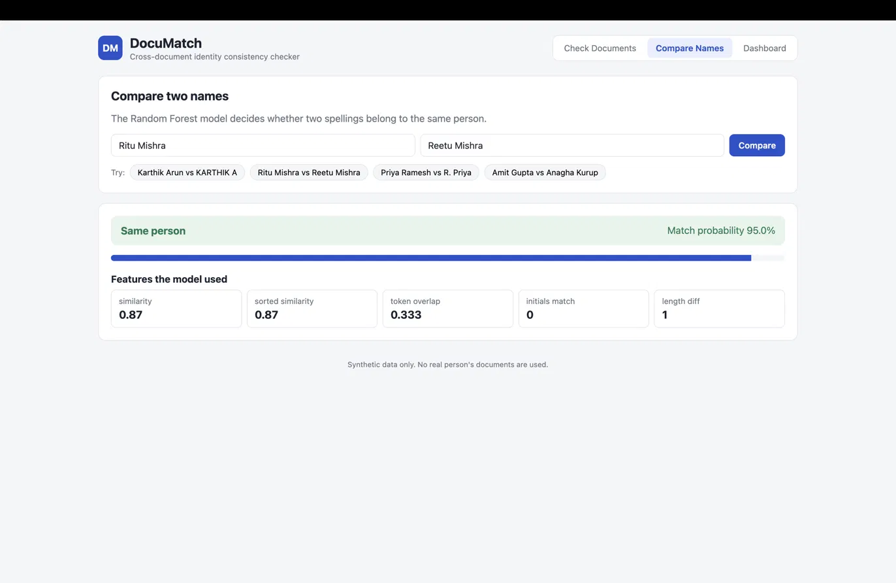
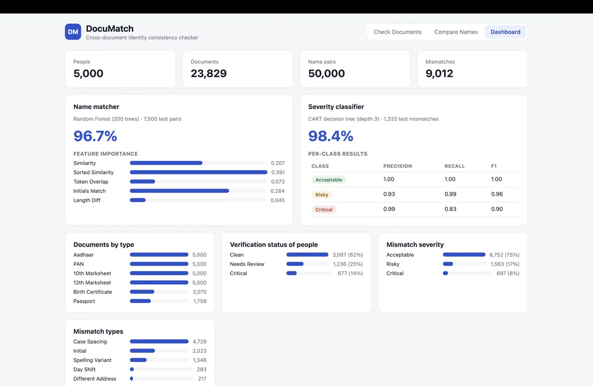

# DocuMatch

**Cross-document identity consistency checker.**

DocuMatch checks whether a person's identity documents (Aadhaar, PAN, 10th and 12th marksheets, birth certificate, passport) agree with each other. Aadhaar is the reference document, and every other document is compared field by field against it. Each mismatch is classified as **Acceptable**, **Risky** or **Critical** and comes with a plain-language explanation.

It combines two machine-learning models with a rule layer:

- a **Random Forest name matcher** that decides whether two spellings belong to the same person (`Karthik Arun` vs `KARTHIK A`)
- a **CART decision tree** that grades the severity of each field-level mismatch
- a **phonetic rule layer** for common Indian-name spelling variants (`Ritu` / `Reetu`, `Laxmi` / `Lakshmi`)

> Synthetic data only. No real person's documents are used.

---

## Screenshots

| Check Documents | Compare Names | Dashboard |
|---|---|---|
|  |  |  |

---

## Features

### 1. Check Documents
- Load a sample person from the dataset (clean, needs review, or critical), edit any field, and run the check.
- Fields compared: **name, father's name, date of birth, gender, address**.
- Aadhaar is the reference. Because Aadhaar has no father's name, that field is taken from the first document that has one.
- Every mismatch shows the reference value, the document's value, its severity, the reason, and (for names) the name-match probability.
- The overall result is the worst severity found, and it's compared against the dataset's ground-truth status.

**Example: critical person**

| Document | Field | Aadhaar | This document | Severity |
|---|---|---|---|---|
| PAN | name | Venkatesh Reddy | VENKATESH REDDY | Acceptable |
| Birth Certificate | gender | M | F | Critical |

Result: **Critical mismatch found** across 4 documents checked against Aadhaar (matches ground truth).

### 2. Compare Names
Type any two names. The app returns a verdict, a match probability, and the five features the model used.

| Name A | Name B | Verdict | Probability |
|---|---|---|---|
| Karthik Arun | KARTHIK A | Same person | > 99% |
| Ritu Mishra | Reetu Mishra | Same person | 95.0% |
| Suresh Reddy | SURESH REDDY | Same person | > 99% |
| Amit Gupta | Anagha Kurup | Different person | < 1% |

### 3. Dashboard
Dataset statistics, model accuracy, feature importance and per-class results, all read from `models/metrics.json`.

---

## Severity levels

| Severity | Meaning | Typical causes |
|---|---|---|
| **Acceptable** | Formatting difference only. Safe to accept. | Case, spacing, initials (`RAJU S` vs `Raju Senthil`) |
| **Risky** | Spelling variant or different value. Needs a manual check. | Typos (`Madhavna`), spelling variants, different address |
| **Critical** | Likely a different person, date or gender. Do not accept without proof. | DOB year shift, day-month swap, gender flip, different person |

---

## How it works

### Name matching

Each pair of names is cleaned (lowercased, dots removed, honorifics such as *Mr*, *Smt*, *Thiru* dropped) and turned into 5 features:

| Feature | What it measures |
|---|---|
| `similarity` | Character-level similarity of the two names (`difflib.SequenceMatcher`) |
| `sorted_similarity` | Similarity after sorting the words, so word order doesn't matter |
| `token_overlap` | Shared words ÷ all distinct words (Jaccard) |
| `initials_match` | 1 if one name's single-letter initials match words in the other (works in both directions) |
| `length_diff` | Difference in length of the cleaned names |

The decision is made in three steps:

1. **Exact after cleaning:** if both names are identical after cleaning, it's the same person (probability 1.0). The model isn't called.
2. **Random Forest:** otherwise, the model predicts the probability that both names belong to the same person.
3. **Phonetic layer:** if both names reduce to the same phonetic key, the probability is raised to at least 0.95.

The phonetic key normalises common Indian spelling variations:

| Rule | Example |
|---|---|
| `x` → `ks` | Laxmi → Laksmi (same as Lakshmi) |
| `ee` → `i`, `oo` → `u`, `aa` → `a` | Reetu → Ritu |
| `th`, `dh`, `bh`, `kh`, `gh`, `sh` → `t`, `d`, `b`, `k`, `g`, `s` | Senthil → Sentil |
| `ph` → `f`, `w` → `v`, `z` → `j` | Ashwin → Asvin |
| Double letters → single | Pallavi → Palavi |

**Why the phonetic layer exists:** with only the 5 features, `Ritu Mishra / Reetu Mishra` (same person) and `Komal Agarwal / Kumar Agarwal` (different people) look almost identical: similarity around 0.87, token overlap 0.333, no initials. The model can't separate them. The phonetic key can: `ritu = ritu`, but `komal ≠ kumar`.

### Severity classification

Each field-level mismatch is turned into 6 features and graded by a CART decision tree:

| Feature | What it measures |
|---|---|
| `similarity` | Character similarity of the two values |
| `initials_match` | Same as above, for name fields |
| `dob_diff` | Days between the two dates, capped at 400 and scaled to 0–1 |
| `is_name` | Field is name or father's name |
| `is_dob` | Field is date of birth |
| `is_gender` | Field is gender |

Name differences that are only case, dots or spacing are always graded **Acceptable**.

---

## Dataset

Fully synthetic Indian identity data.

| | Count |
|---|---|
| People | 5,000 |
| Documents | 23,829 |
| Name pairs (for the name matcher) | 50,000 |
| Field-level mismatches (for the severity classifier) | 9,012 |

**Documents by type:** Aadhaar 5,000 · PAN 5,000 · 10th Marksheet 5,000 · 12th Marksheet 5,000 · Birth Certificate 2,070 · Passport 1,759

**Verification status of people:** Clean 3,087 · Needs Review 1,236 · Critical 677

**Mismatch severity:** Acceptable 6,752 (75%) · Risky 1,563 (17%) · Critical 697 (8%)

**Mismatch types:**

| Type | Count |
|---|---|
| Case / spacing | 4,729 |
| Initial | 2,023 |
| Spelling variant | 1,346 |
| Day shift | 283 |
| Different address | 217 |
| Year shift | 159 |
| Different person | 132 |
| Flipped (gender) | 63 |
| Day-month swap | 60 |

| File | Contents |
|---|---|
| `data/persons.csv` | One row per person with ground-truth verification status |
| `data/identity_records.csv` | One row per document |
| `data/name_pairs.csv` | Labelled name pairs with pair type and train/val/test split |
| `data/mismatch_labels.csv` | Labelled field-level mismatches |

---

## Model results

### Name matcher: Random Forest (200 trees)

**Accuracy: 96.7%** on 7,500 test pairs.

| Feature | Importance |
|---|---|
| Sorted similarity | 0.391 |
| Initials match | 0.284 |
| Similarity | 0.207 |
| Token overlap | 0.072 |
| Length diff | 0.045 |

### Severity classifier: CART decision tree (depth 3)

**Accuracy: 98.4%** on 1,333 test mismatches.

| Class | Precision | Recall | F1 |
|---|---|---|---|
| Acceptable | 1.00 | 1.00 | 1.00 |
| Risky | 0.93 | 0.99 | 0.96 |
| Critical | 0.99 | 0.83 | 0.90 |

> These figures measure the models alone. The exact-match and phonetic rules in the API are applied on top of the Random Forest at prediction time.

---

## Tech stack

| Layer | Tools |
|---|---|
| Frontend | React, Vite |
| Backend | FastAPI, Uvicorn, Pydantic |
| ML | scikit-learn (Random Forest, Decision Tree), pandas, joblib |
| Data | Synthetic CSV datasets |

---

## Project structure

```
DocuMatch/
├── backend/
│   └── main.py              # FastAPI app: name matching, document checks, metrics, samples
├── ml/
│   ├── features.py          # Feature engineering shared by training and the API
│   └── train.py             # Trains and saves both models + metrics.json
├── models/
│   ├── name_matcher.joblib  # Random Forest name matcher
│   ├── severity_tree.joblib # CART severity classifier
│   └── metrics.json         # Accuracy, feature importance, dataset stats
├── data/
│   ├── persons.csv
│   ├── identity_records.csv
│   ├── name_pairs.csv
│   └── mismatch_labels.csv
├── frontend/
│   └── src/
│       └── App.jsx          # Check Documents, Compare Names, Dashboard
└── requirements.txt
```

---

## API

Interactive docs: `http://127.0.0.1:8000/docs`

| Method | Endpoint | Description |
|---|---|---|
| GET | `/` | Health check |
| POST | `/api/compare-names` | Compare two names |
| POST | `/api/check-documents` | Check a set of documents against Aadhaar |
| GET | `/api/metrics` | Model metrics and dataset statistics |
| GET | `/api/samples?status=critical&n=6` | Random sample people from the dataset |

**Compare names**

```bash
curl -X POST http://127.0.0.1:8000/api/compare-names \
  -H "Content-Type: application/json" \
  -d '{"name_a": "Ritu Mishra", "name_b": "Reetu Mishra"}'
```

```json
{
  "name_a": "Ritu Mishra",
  "name_b": "Reetu Mishra",
  "same_person_probability": 0.95,
  "verdict": "same person",
  "features": {
    "similarity": 0.87,
    "sorted_similarity": 0.87,
    "token_overlap": 0.333,
    "initials_match": 0,
    "length_diff": 1
  }
}
```

**Check documents**

```bash
curl -X POST http://127.0.0.1:8000/api/check-documents \
  -H "Content-Type: application/json" \
  -d '{"documents": [
        {"doc_type": "aadhaar", "name": "Raju Senthil", "dob": "1999-12-02", "gender": "M"},
        {"doc_type": "birth_certificate", "name": "Raju Senthil", "father_name": "Senthil", "dob": "1999-02-12", "gender": "M"}
      ]}'
```

Returns the reference document, number of documents checked, overall status (`clean`, `needs_review` or `critical`), a severity summary, and every mismatch with its explanation.

---

## Run locally

**Requirements:** Python 3.10+, Node.js 18+

### 1. Backend

```bash
cd DocuMatch
python3 -m venv venv
source venv/bin/activate          # Windows: venv\Scripts\activate
pip install -r requirements.txt
cd backend
uvicorn main:app --reload
```

The API runs at `http://127.0.0.1:8000`.

### 2. Frontend

In a second terminal:

```bash
cd DocuMatch/frontend
npm install
npm run dev
```

Open `http://localhost:5173`.

### 3. Retrain the models (optional)

The trained models are already in `models/`. To retrain them, run from the project root with the virtual environment active:

```bash
python ml/train.py
```

---

## Limitations

- The phonetic layer covers common transliteration variants only. Transposition typos such as `Madhavan` / `Madhavna` are left to the model and graded **Risky** for manual review.
- The data is synthetic, so real-world documents (OCR errors, regional scripts) would need extra handling.
- Critical recall is 0.83: some critical mismatches are graded Risky. Risky items still go to manual review, so they aren't silently accepted.


